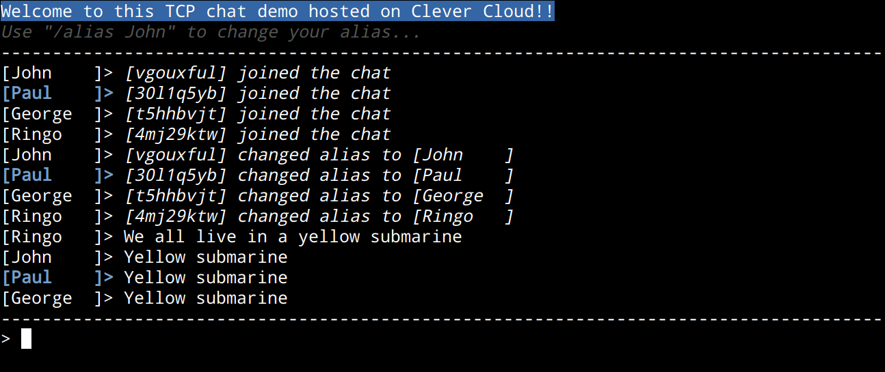

# TCP Chat demo

A dead simple TCP chat built for deno with JavaScript.



## Install dependencies

To run this project with deno, you need to install its dependencies with:

```bash
npm run install
```

NOTE: This can seem weird to install Node.js dependencies for deno but it our case, it makes sense: 

* We tried to use deno's [cursor](https://deno.land/x/cursor) module but it lacked some featues and did not fit a TCP session usage, so we loaded [ansi-escapes](https://github.com/sindresorhus/ansi-escapes) as CJS with deno's Node.js compatibility support for CJS.
* There is no need to create a [nodemon](https://nodemon.io/) for deno as it already handles this use case with `--exec`.

## Run

To run this project, you can use the `start` npm script like this:

```bash
npm run start
```

NOTES:

* This will run the app with deno which is packaged in this git repo in `bin/deno`.
* The script is run with a few params:
  * `--allow-net` for the HTTP and TCP servers
  * `--allow-env` to read environment variables
  * `--allow-read` seems to be required by the HTTP server
  * `--unstable` to allow support for CJS loading
  * `--lock=deno-lock.json` to make sure we don't run scripts that changed

If you're contributing to this project and work with it on your local machine, you can use the `start:dev` npm script like this:

```bash
npm run start:dev
```

[nodemon](https://nodemon.io/) will watch your files and auto restart the server when you change something.

NOTE: This can seem weird to use npm scripts to run deno but we think this kind of script feature is lacking and it's what Clever Cloud will use (for now).

## Deploy

To deploy this demo on [Clever Cloud](https://www.clever-cloud.com/en/):

* You can create your app in the console UI and use a `git push`
* You can also do everything with the [clever-tools CLI](https://github.com/CleverCloud/clever-tools/):

```bash
clever create -t node tcp-chat-demo
clever env set TCP_PORT 4040
PUBLIC_TCP_PORT=$(clever tcp-redirs add --namespace cleverapps | sed 's/.*: //g')
clever env set PUBLIC_TCP_PORT ${PUBLIC_TCP_PORT}
clever deploy
```

NOTE: The only "hack" to make this work in a Node.js app on Clever Cloud is to provide the `deno` binary in the git repo.

Once this is deployed, you can browse your app as HTTP with:

```bash
clever open
``` 

It will prompt you a `nc` command to connect to your TCP chat.
